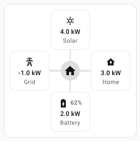
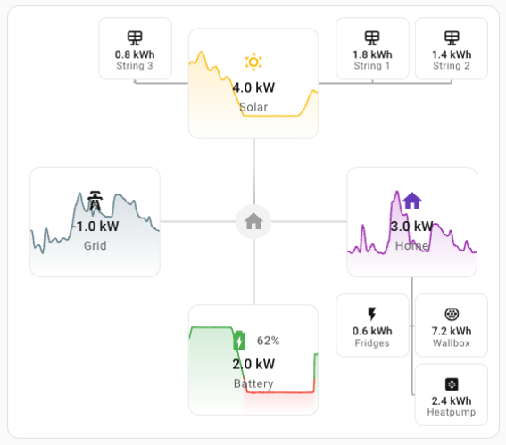
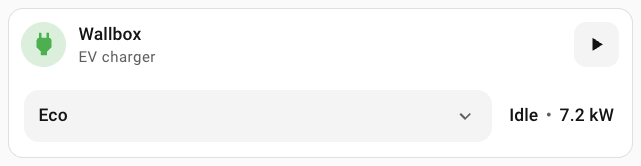
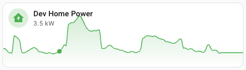
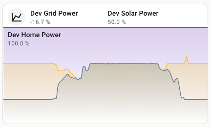

# 🍄‍🟫 PowerPilz

[![hacs][hacs-badge]][hacs-url]







## 🍄‍🟫 What is PowerPilz ?

PowerPilz is a collection of cards for the Home Assistant Dashboard UI, focused on energy and EV charging use cases.

The name is modeled after Mushroom. `Pilz` is German for `mushroom`, and the visual style follows that design language.

### 🍄‍🟫 Features

- Editor support for all cards and all important options
- Mushroom-like spacing, typography and controls
- Energy flow card with optional sub-nodes and trend overlays
- Wallbox card focused on EV charging control and status
- Graph and stacked graph cards with up to 4 entities
- HACS-ready project structure

## 🍄‍🟫 Installation

### 🍄‍🟫 HACS

PowerPilz is installable through HACS as a custom dashboard repository.

1. Open HACS in Home Assistant.
2. Go to `Frontend`.
3. Open menu (top-right) -> `Custom repositories`.
4. Add your PowerPilz GitHub repository URL.
5. Select category `Dashboard`.
6. Install PowerPilz.

If resource auto-registration is disabled or you use YAML dashboards, add:

```yaml
resources:
  - url: /hacsfiles/<repository-name>/power-pilz.js
    type: module
```

### 🍄‍🟫 Manual

1. Download `power-pilz.js` from the latest release.
2. Put `power-pilz.js` in your Home Assistant `config/www` folder.
3. Add resource to dashboard:
   - URL: `/local/power-pilz.js`
   - Type: `JavaScript Module`

## 🍄‍🟫 Usage

All PowerPilz cards can be configured with the Home Assistant dashboard UI editor.

1. Open your dashboard.
2. Click the 3-dot menu in the top-right.
3. Click `Edit dashboard`.
4. Click `+ Add card`.
5. Search for `Custom: PowerPilz ...` cards.

### 🍄‍🟫 Cards

- ⚡ [Energy card](docs/cards/energy.md)
- 🔌 [Wallbox card](docs/cards/wallbox.md)
- 📈 [Graph card](docs/cards/graph.md)
- 🧱 [Graph stack card](docs/cards/graph-stack.md)

## 🍄‍🟫 Development

### 🍄‍🟫 Local build

```sh
npm install
npm run build
```

### 🍄‍🟫 Dev server

```sh
npm run dev
```

## 🍄‍🟫 Troubleshooting

### 🍄‍🟫 I don't see the latest changes

1. Hard refresh the browser (or clear browser cache).
2. Confirm the newest `power-pilz.js` is loaded in dashboard resources.
3. If using HACS, re-download the latest version.

## 🍄‍🟫 Credits

Design direction is inspired by Mushroom cards.

<!-- Badges -->

[hacs-url]: https://github.com/hacs/integration
[hacs-badge]: https://img.shields.io/badge/hacs-custom-orange.svg?style=flat-square
