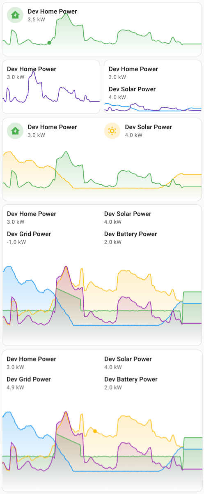

# 🍄‍🟫 Graph card



## Description

The Graph card renders up to 4 entity trends in a Mushroom-style card with legend rows/columns, hover inspection and configurable timeframe.

## Configuration variables

All options are available in the Lovelace editor, but you can also use YAML.

### Global options

| Name | Type | Default | Description |
| :-- | :-- | :-- | :-- |
| `type` | string | Required | `custom:power-pilz-graph-card` |
| `legend_layout` | `row` \| `column` | `row` | Layout of entity legend labels |
| `timeframe_hours` | `6` \| `12` \| `24` | `24` | Time window shown in graph |
| `line_thickness` | number | `1.5` | Line width for all graphs |
| `clip_graph_to_labels` | boolean | `false` | Keep graph below label area |
| `hover_enabled` | boolean | `true` | Enable hover dot + value inspection |
| `fill_area_enabled` | boolean | `true` | Enable gradient fill below each line |
| `unit` | string | entity unit | Optional unit override |
| `decimals` | number | `1` | Decimal precision |

### Per-entity options

The card supports entities `1..4`.

| Name pattern | Description |
| :-- | :-- |
| `entity_<n>` | Sensor entity id |
| `entity_<n>_name` | Custom display name (overrides friendly name) |
| `entity_<n>_enabled` | Show/hide this entity series |
| `entity_<n>_show_icon` | Show/hide this entity icon in legend |
| `entity_<n>_icon` | Icon shown in legend |
| `entity_<n>_icon_color` | Icon color |
| `entity_<n>_trend_color` | Graph color for that entity |

## Example YAML

```yaml
type: custom:power-pilz-graph-card
legend_layout: row
timeframe_hours: 24
line_thickness: 1.5
hover_enabled: true
fill_area_enabled: true
entity_1: sensor.dev_home_power
entity_1_name: Home
entity_1_enabled: true
entity_1_icon: mdi:home-lightning-bolt
entity_1_trend_color: blue
entity_2: sensor.dev_solar_power
entity_2_name: Solar
entity_2_enabled: true
entity_2_icon: mdi:weather-sunny
entity_2_trend_color: amber
```
